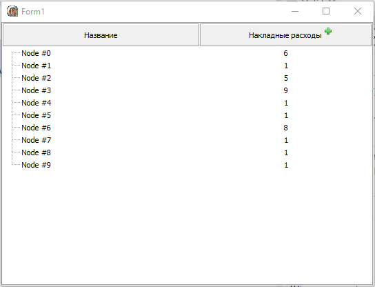

# dephi_vtv_layered_header

The project demonstrates how you can make a multi-level header for a tree

Source code taken from here http://forum.vingrad.ru/index.php?showtopic=230759&view=findpost&p=1660701

#### 0.0.1

